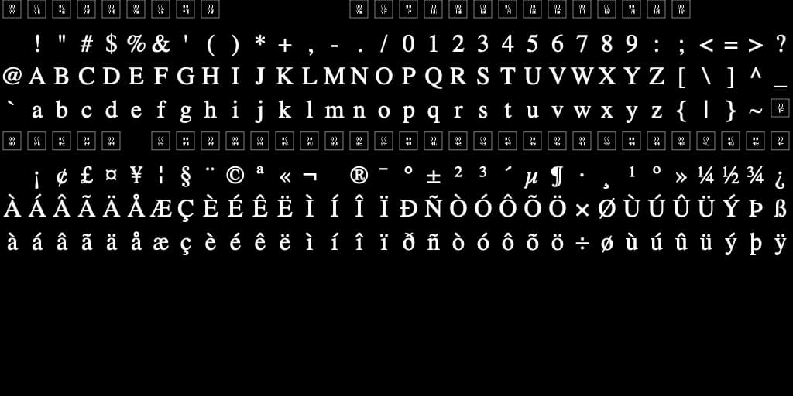

# Game Engine

Frank Mayer


---

## Ziel

- Eigene Game Engine
- Golang
- Cross Plattform
- Texturen laden & rendern
- CI/CD einfach einzurichten
  - Einfaches Testing
  - Export kompatibel mit Steam
- Level Editor

---

## Warum?

- Kann ich es besser als etablierte Engines?
- Warum Go?

---

## Was ist ein Shader

- Programm für die GPU
- GLSL, ESSL, HLSL, MSL, ...
- Mehrere APIs für Betriebssysteme

---

## Was ist OpenGL, Vulkan, DirextX und Metal?

- Kein Programm/Software
- Hardware interface
- Standartisierung

---

## Schwierigkeiten

- OpenGL & Vulkan auf Mac
- Text rendern

---

## OpenGL auf Mac

- Deprecated (v4.1)
- Bugs in GLSL die nie gefixt werden

---

## Vulkan auf Mac

- MoltenVK als Zwischenlayer zu Metal
- XCode Projektstruktur

---

## Alternativen zu DirectX, OpenGL, Vulkan, ...

- SDL
- raylib
- Dawn

---

## SDL (Simple DirectMedia Layer)

[libsdl.org](https://libsdl.org)

- C Library
- Zwischenlayer zu hardware APIs
- Low level API

---

## raylib

[raylib.com](https://www.raylib.com)

- C Library
- Zwischenlayer zu hardware APIs
- High level API

---

## Dawn

[dawn.googlesource.com/dawn](https://dawn.googlesource.com/dawn)

- Googles native WebGPU-Implementierung
- Zwischenlayer zu hardware **grafik** APIs
- [Tint](https://dawn.googlesource.com/tint) Compiler von und zu [WGSL](https://www.w3.org/TR/WGSL/)
- C++ Library

---

## DirectX Windows

http://www.directxtutorial.com/Lesson.aspx?lessonid=9-1-3

```C
// include the basic windows header file
#include <windows.h>
#include <windowsx.h>

// the WindowProc function prototype
LRESULT CALLBACK WindowProc(HWND hWnd,
                         UINT message,
                         WPARAM wParam,
                         LPARAM lParam);

// the entry point for any Windows program
int WINAPI WinMain(HINSTANCE hInstance,
                   HINSTANCE hPrevInstance,
                   LPSTR lpCmdLine,
                   int nCmdShow)
{
    // the handle for the window, filled by a function
    HWND hWnd;
    // this struct holds information for the window class
    WNDCLASSEX wc;

    // clear out the window class for use
    ZeroMemory(&wc, sizeof(WNDCLASSEX));

    // fill in the struct with the needed information
    wc.cbSize = sizeof(WNDCLASSEX);
    wc.style = CS_HREDRAW | CS_VREDRAW;
    wc.lpfnWndProc = WindowProc;
    wc.hInstance = hInstance;
    wc.hCursor = LoadCursor(NULL, IDC_ARROW);
    wc.hbrBackground = (HBRUSH)COLOR_WINDOW;
    wc.lpszClassName = L"WindowClass1";

    // register the window class
    RegisterClassEx(&wc);

    // create the window and use the result as the handle
    hWnd = CreateWindowEx(NULL,
                          L"WindowClass1",    // name of the window class
                          L"Our First Windowed Program",   // title of the window
                          WS_OVERLAPPEDWINDOW,    // window style
                          300,    // x-position of the window
                          300,    // y-position of the window
                          500,    // width of the window
                          400,    // height of the window
                          NULL,    // we have no parent window, NULL
                          NULL,    // we aren't using menus, NULL
                          hInstance,    // application handle
                          NULL);    // used with multiple windows, NULL

    // display the window on the screen
    ShowWindow(hWnd, nCmdShow);

    // enter the main loop:

    // this struct holds Windows event messages
    MSG msg;

    // wait for the next message in the queue, store the result in 'msg'
    while(GetMessage(&msg, NULL, 0, 0))
    {
        // translate keystroke messages into the right format
        TranslateMessage(&msg);

        // send the message to the WindowProc function
        DispatchMessage(&msg);
    }

    // return this part of the WM_QUIT message to Windows
    return msg.wParam;
}

// this is the main message handler for the program
LRESULT CALLBACK WindowProc(HWND hWnd, UINT message, WPARAM wParam, LPARAM lParam)
{
    // sort through and find what code to run for the message given
    switch(message)
    {
        // this message is read when the window is closed
        case WM_DESTROY:
            {
                // close the application entirely
                PostQuitMessage(0);
                return 0;
            } break;
    }

    // Handle any messages the switch statement didn't
    return DefWindowProc (hWnd, message, wParam, lParam);
}
```

---

## SDL Fenster

```C
#include <SDL.h>

SDL_Init(SDL_INIT_VIDEO);
SDLWindow = SDL_CreateWindow(
    "Hello Window", 0, 0, 500, 300, 0
);
```

---

## Erklärung Shader

### Vertex Shader

- Transformiert die 3D-Koordinaten der Vertices.
- Kann Vorverarbeitungen für die Beleuchtung durchführen, wie zum Beispiel die Berechnung von Normalenvektoren an den Vertices.
- Führt oft einfache Beleuchtungsberechnungen auf den Vertices durch, um eine grobe Vorstellung von Licht und Schatten zu haben.

### Fragment Shader

- Kümmert sich um die Beleuchtung auf Pixel-Ebene.
- Verarbeitet die interpolierten Werte der Vertex Shader-Ausgabe, um die endgültige Farbe jedes Pixels zu bestimmen.
- Implementiert komplexe Beleuchtungsberechnungen, Texturen, Schatten und andere visuelle Effekte.

---

## GLSL Code (Open GL)

Vertex shader

```glsl
#version 330 core
layout (location = 0) in vec3 aPos; // the position variable has attribute position 0

out vec4 vertexColor; // specify a color output to the fragment shader

void main()
{
    gl_Position = vec4(aPos, 1.0); // see how we directly give a vec3 to vec4's constructor
    vertexColor = vec4(0.5, 0.0, 0.0, 1.0); // set the output variable to a dark-red color
}
```

Fragment shader

```glsl
#version 330 core
out vec4 FragColor;

in vec4 vertexColor; // the input variable from the vertex shader (same name and same type)

void main()
{
    FragColor = vertexColor;
}
```

---

## Text rendern

- Charmap
- Fonts

---

## Charmap



---

## Fonts

- True Type Font Format (TTF)
- Open Type Font Format (OTF)
- Web Open Font Format (WOFF or WOFF2)
- Open Type Scalable Vector Graphic (OT-SVG)
- Embedded Open Type Font Format (EOT)

---

## Live Demo

---

## Eigene Engine: Pro

- Individuelle Anpassung
- Optimierung
- Flexibilität
- Lernmöglichkeiten
- 3rd Party Engines veralten, Portierung in Zukunft wird erschwert

---

## Eigene Engine: Contra

- Zeitaufwand
- Kosten
- Aktualisierungen und Support
- Risiken

---

## Firmen mit eigener Engine für ihre Spiele

- **id Software** id Tech
- **CD Project Red** red
- **Massive Entertainment** Snowdrop
- **From Software** Dantelion (inoffiziell)
- **Riot Games**
- **Valve Corporation** Source
- **Epic Games** Unreal
- **Remedy** Northlight
- **Thekla**
- **Cry Tech** Cry Engine

---


